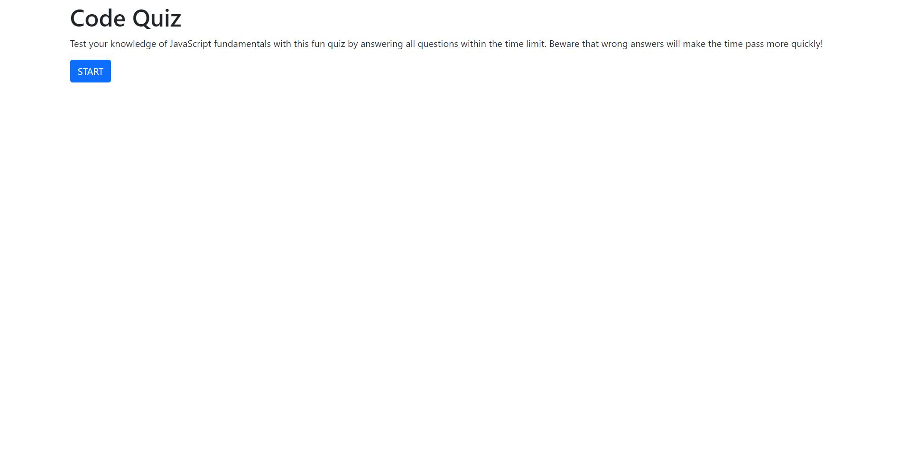
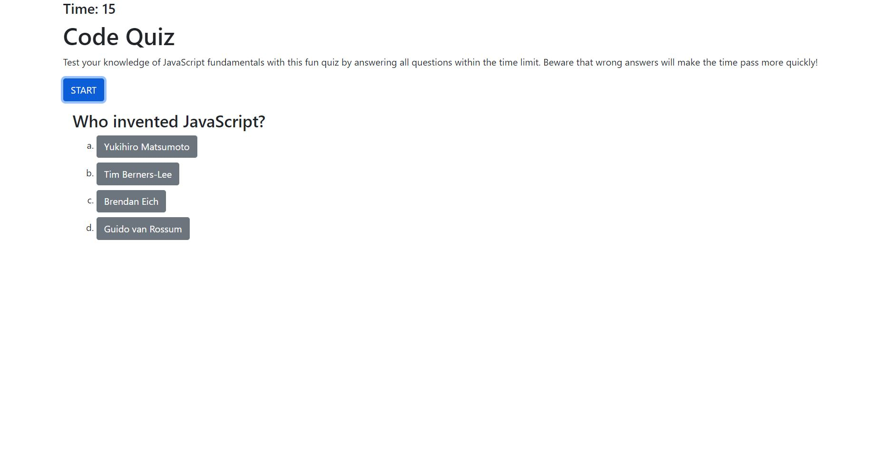
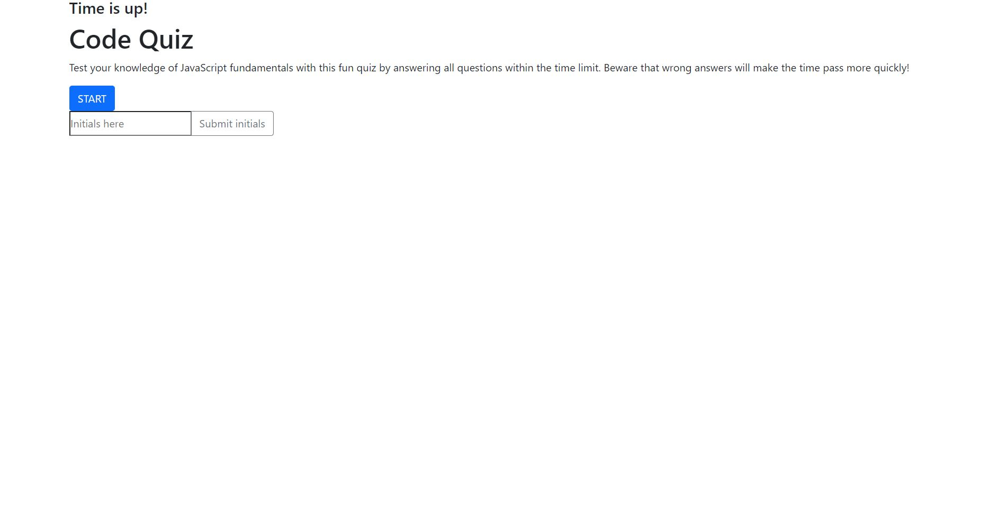

# Code Quiz
What better way to understand a concept than to create the quiz yourself?

## Table of Contents

- [Description](#description)
- [Deployed Application](#deployed-application)
- [Future Improvements](#future-improvements)
- [Installation](#installation)
- [Usage](#usage)
- [Credits](#credits)
- [License](#license)

## Description

This is a short and fun quiz about JavaScript fundamentals!

## Deployed Application

https://miss-mad.github.io/code-quiz/

## Future Improvements

* I need to make more detailed commit messages. For this challenge, I became focused in the challenge itself and forgot to commit after each section of the project, so I ctrl + z’ed through the js file to make several commits at different stages, each with more detailed and hopefully more helpful commit messages. For the next challenge, I will definitely commit more often throughout my work so I don’t have to backtrack. I did commit regularly for the other challenges so far, but this was the odd one out.

* I would improve upon the score/leaderboard aspect of the quiz, both formatting the scores list to add some color and excitement, and categorizing them by place (first place, second place, etc.).

* I would have the START button let the user begin the quiz again without having to refresh the page.

* I would move the timer so that it doesn’t make the questions jump down when the timer appears at the top.

* I would also figure out why there’s a slight delay in the timer appearing on the page after the rest of the page and the quiz question has loaded.

* I would display the user’s score as they go through the quiz, not just at the end after submitting the initials.
I would generally give the appearance a makeover with more design and color.

## Installation

No installation necessary.

## Usage

Below are screenshots of the code quiz.

## Credits

List of resources used:

https://johnpopenuck.wordpress.com/2016/08/23/johns-famous-simple-at-least-28-step-depending-on-circumstances-grilled-cheese-sandwich-recipe/

https://getbootstrap.com/docs/5.0/layout/containers/#fluid-containers

https://stackoverflow.com/questions/3486110/make-a-list-item-clickable-html-css

https://www.w3schools.com/jsref/jsref_parseint.asp

## License

No licenses.

---